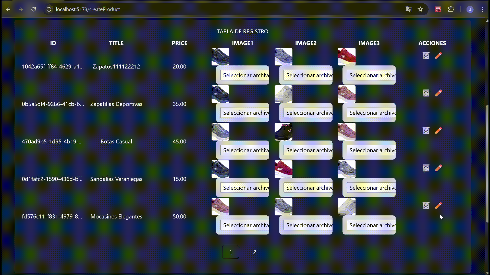

# Documentación del Proyecto

Esta documentación cubre el flujo completo de la aplicación: creación, edición y eliminación de productos; gestión de carrito; pasarela de pagos con Stripe; actualización de estado vía webhook; y despliegue con Docker.

---

## Índice

1. [Descripción general](#descripción-general)
2. [Stack tecnológico](#stack-tecnológico)
3. [Arquitectura de la aplicación](#arquitectura-de-la-aplicación)
4. [Estructura del repositorio](#estructura-del-repositorio)
5. [Entornos y variables de configuración](#entornos-y-variables-de-configuración)
6. [Instalación y ejecución local](#instalación-y-ejecución-local)
7. [Despliegue con Docker](#despliegue-con-docker)
8. [Flujo General de la app](#flujo-General-de-la-app)
9. [Cinco Secciones Principales](#cinco-secciones-principales)


---


## Descripción general

La aplicación permite gestionar un catálogo de productos (create, read, update, delete), un carrito de compras y realizar el pago a través de Stripe. Tras el pago, un webhook de Stripe actualiza el estado del carrito.

La aplicación incluye:

- `Autenticación` con JWT (registro, login, perfil) y control de roles (USER, ADMIN)
- CRUD de productos con validaciones, filtros y paginación
- Documentación interactiva con `Swagger`
- Flujo de compra de prodcutos de pago e integracion con stripe
- `Upload de archivos`: Se utiliza Multer para adjuntar imágenes a las tareas
- `Docker Compose`: Configuración para levantar backend, frontend y PostgreSQL en contenedores


---

## Stack tecnológico

* **Frontend**: React 18, Vite, TypeScript, Tailwind CSS, Framer Motion, React Router v6
* **Backend**: NestJS 9, TypeScript, TypeORM, PostgreSQL, Swagger
* **Autenticación**: JWT (Passport)
* **Pagos**: Stripe SDK & Stripe CLI (webhooks)
* **Almacenamiento de archivos**: ServeStatic (local) o AWS S3
* **Testing**: Jest, Supertest
* **Docker**: Dockerfiles para front y back, Docker Compose

---

## Arquitectura de la aplicación

1. **Frontend** (SPA) consume la API REST del backend.
2. **Backend** expone endpoints:

   * Autenticacion y creacion de usuarios: `/users` y `/auth/login`
   * Gestión de productos y subida de archivos `/productos` y `/files`
   * Carrito `/carrito`
   * Pasarela de pago `/pagos`

4. **Base de datos** PostgreSQL guarda usuarios, productos, carritos y pagos.
5. **Uploads**: imágenes de productos se guardan en carpeta `uploads` y se sirven estáticamente en `/uploads`.
5. **Documentación swagger**: Documentacion de la la api en `/docs`.
---

## Estructura del repositorio

```
├── back/                        # Código backend (NestJS)
│   ├── src/
│   ├── uploads/                 # Imágenes seed y subidas runtime
│   ├── .env                     # Variables de entorno
│   └── package.json
├── front/                       # Código frontend (React + Vite)
│   ├── src/
│   ├── nginx.conf               # Config para container estático
│   ├── .env                     # Variables de entorno Vite
│   └── package.json
├── Dockerfile.back              # Dockerfile único en root para 
├── Dockerfile.front             # Dockerfile único en root para 
├── docker-compose.yml
└── README.md                    # Esta documentación
```

---

## Entornos y variables de configuración

Antes de ejecutar la aplicación, debes generar tus archivos de entorno a partir de los ejemplos incluidos:

**Frontend/Backend**

   ```bash
   cp back/.env.example back/.env
   cp front/.env.example front/.env
   ```

   Luego abre `back/.env` o `front/.env` y ajusta las variables.

---

## Instalación y ejecución local

### Backend

```bash
cd back
npm install
npm run start:dev
```

Accede a `http://localhost:3000` y Swagger en `/docs`.

### Frontend

```bash
cd front
npm install
npm run dev
```

Visita `http://localhost:5173`.

---

## Despliegue con Docker

### Levantar todo con Docker Compose

```bash
docker-compose up --build
```

### Instrucciones Docker

* **Dockerfile.back**: build en 2 etapas, copia seed images (back/uploads) y dist.
* **Dockerfile.front**: build de Vite y nginx para servir `dist/`.
* **docker-compose.yml**: servicios `postgres`, `backend`, `frontend`, `stripe` (CLI).

---

## Flujo general de la app

1. **Login y registro de usuario**  
   

2. **Crear producto**  
   

3. **Eliminar y actualizar producto**  
     
   

4. **Añadir al carrito y crear orden de pago**  
     
   

5. **Webhook de Stripe y actualización de estado de pago**  
   

6. **Flujo de checkout**  
   1. Usuario confirma compra → `createPaymentSession` → obtiene URL de Stripe.  
   2. Front redirige a Stripe Checkout.  
   3. Stripe emite evento `checkout.session.completed`, etc.  
   4. Stripe CLI (Docker) escucha y reenvía a `/webhook`.  
   5. Backend valida firma y actualiza el estado del carrito.

---


## Cinco Secciones Principales

La interfaz del usuario está organizada en cinco pantallas o secciones clave:

| Sección  | Descripción                                                                                         |
| -------- | --------------------------------------------------------------------------------------------------- |
| **Crear**    | CRUD de productos: formulario para **crear**, **editar** y **eliminar** productos del catálogo.      |
| **Ver**      | Listado de productos con filtros y paginación: permite explorar visualmente todos los productos.   |
| **Detalle**  | Página de detalle de producto: muestra toda la información, imágenes y opciones de compra.         |
| **Carrito**  | Vista del carrito activo: permite ver los ítems añadidos, ajustar cantidades y eliminar artículos. |
| **Pagos**    | Gestión de órdenes de pago: muestra todos los carritos convertidos en órdenes y su estado actual.  |

---